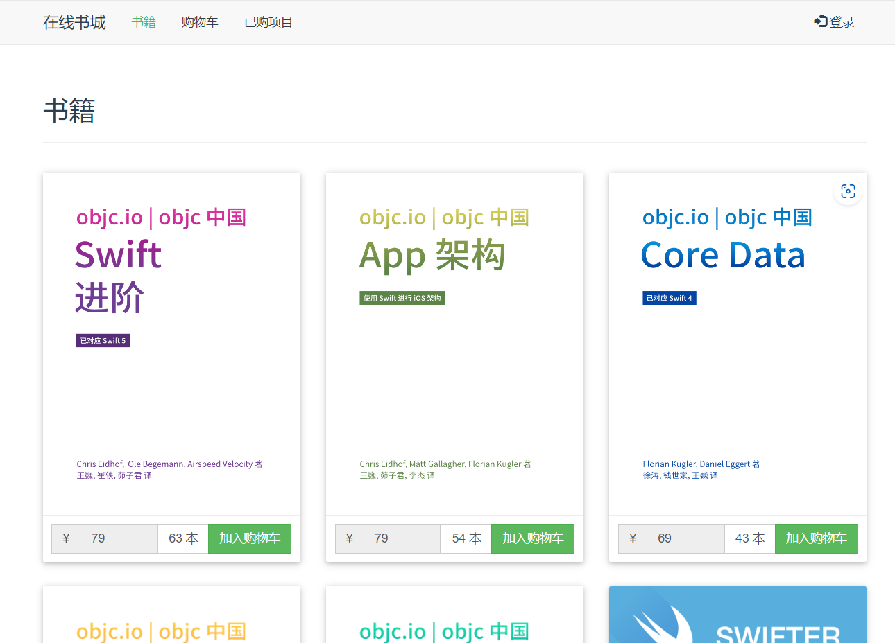
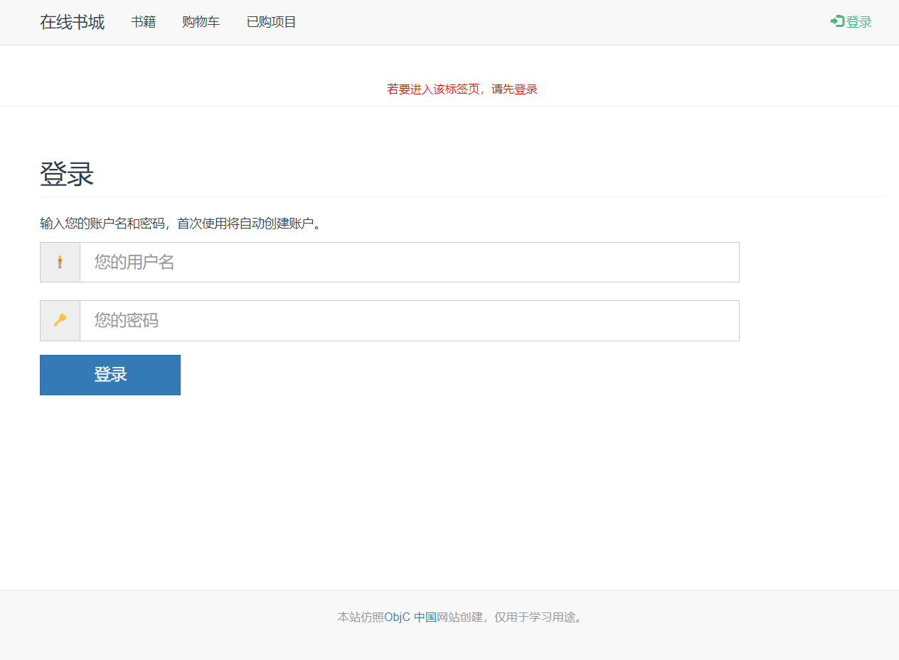
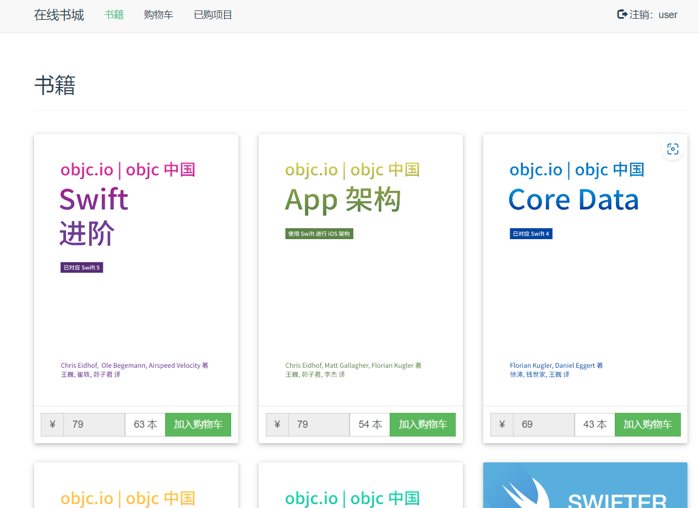
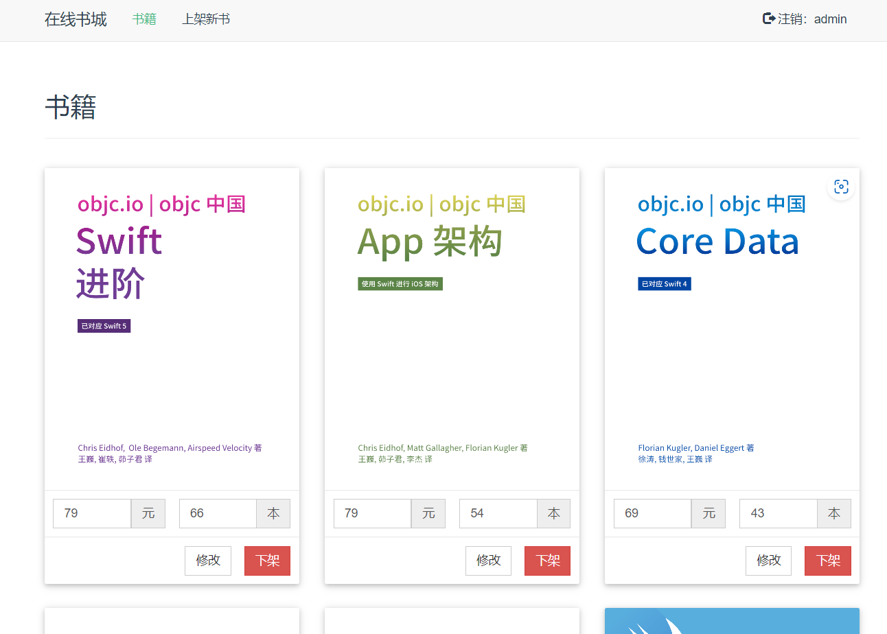
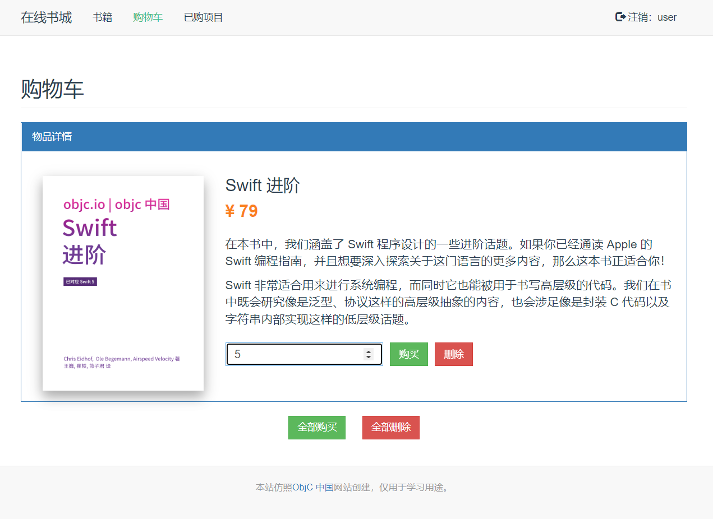
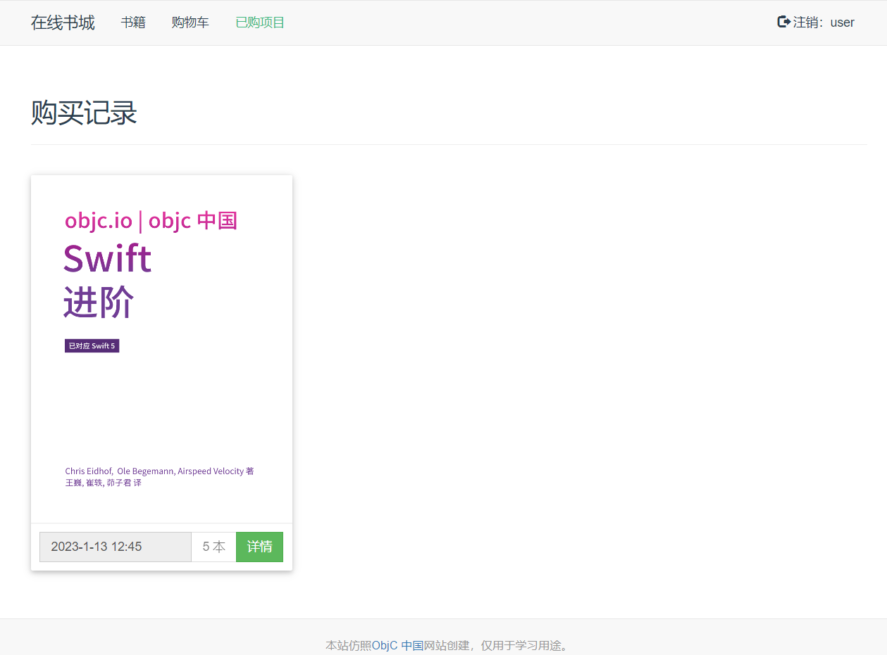

# Retailer

一个网上书店应用示例。

- 前端：Vue + Nginx
- 后端：Spring Boot + MyBatis + Mysql + Docker

# 图片预览

未登录首页：



登陆页：



普通用户首页：



管理员首页：



用户购物车：



用户购买记录：



## 构建

- 需要docker与docker-compose。（代码在wsl2上测试通过）

```bash
cd docker-compose
# 脚本运行后需要输入管理员密码，因为有的环境的docker命令需要管理员权限
bash ./build.sh
sudo docker-compose up
```

如果对文件进行了修改，需要先关闭容器、删除镜像，再重新构建，避免之前的内容对结果造成影响。

## 运行说明

- 运行时将对外开放两个端口，如果端口被占用（端口被占用程序仍可能正常运行，但是无法通过浏览器进行访问），则需要修改`build.sh`文件，设置两个没有被占用的端口。参见[关于端口被占用](#关于端口被占用)。
- html中用到了CDN，因此需要在联网状态下运行。
- 访问方法：打开浏览器，输入`localhost:$NGINX_PORT`（在`build.sh`中），假定NGINX对外暴露的端口是8080，则输入`localhost:8080`访问。只能够在本机访问，如果要部署到服务器，并在任意一台电脑上访问，参见[其他](#其他)。
- 管理员id是`admin`，密码是`123`；普通用户若在库则需要输入正确密码登录，若不在库则第一次登录自动注册（输入任意密码都可以登录）。

## BUG

## 其他

### 关于端口被占用

wsl2的端口已经暴露出来了，但是在wsl2里面查不到，是为什么？

可以用`netstat -ano`查询。如果还是查不到，可能是因为端口被占用了（比如被hyper-v）。打开powershell，输入：

```powershell
netsh interface ipv4 show excludedportrange protocol=tcp
```

如果输出中找到了对外暴露的端口区段，说明端口被占用，修改`docker-compose/build.sh`换端口即可。

### 关于动态获取IP构建

使用的获取IP的命令是依赖网络的，有时候工作不正常。遇到这种情况，就需要手动修改参数重新构建。

### 不能延后的依赖

虽然后端的端口和主机配置可以在运行时或`docker-compose`构建时完成，但是前端向后端发送的API代码只能够在`npm run build`时完成。导致前端无法真正解耦。目前是使用8092作为Java服务器的端口，本机作为主机名，即是说，如果需要部署在服务器上，则需要修改前端`frontend/src/store/index.js`，修改其中的主机和端口为服务器，然后重新构建，再将生成的dist文件夹覆盖拷贝到`docker-compose/nginx/`。目前已经尝试过在容器启动之后用`sed`对js脚本用环境变量进行模式替换，但是实测还是注入失败。
