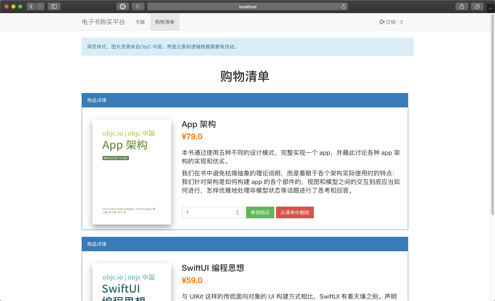

# Retailer

## 前面

这是JavaEE的结课作业。采用的技术是Spring Boot和Thymeleaf模板的方式。图片、样式等资源是直接从ObjC 中国的网站上面下载的（这个网站我还蛮喜欢的，以前有读过里面的书，写的还挺不错——虽然囫囵吞枣没怎么学懂），`wget`大法好。

这个作业嗯，用了很多比较脏的方法，比如明明知道事务的概念，却因为时间来不及（或许应该叫做懒）做了很多不安全的操作；关于有些公共代码，由于需要返回值等比较复杂的情况，也一时没有想到办法提取出来。

最初也尝试了一下Vue，花了两天不太会整合到Spring Boot工程中来，也不太能够理解各种以vue结尾的文件的关系。试过Vaadin，没成功，而且启动速度变慢了很多，js也不太会写……里面有一处用了ajax，给后端发了个请求被Servlet给处理了，就用了这么一处。

资源文件中也有一些是多余的，因为时间不够最后没做。

## 设计

-   账户不存在则会自动创建，账户若存在则会检查密码。
-   购买和删除清单项目的区别是库存是否会减少。
-   因为blob存起来感觉比较麻烦（也没有学过），就没有把图片资源存到数据库中。
-   用户对清单中的项目数目进行编辑，数量信息是保存在内存中的，只有点击保存按钮或者全部购买才会提交。其它按键包括单独购买会导致其它项目的编辑不被保存。

## 截图





另外是结构图，同级目录下有其pdf版本：


# 运行

## 准备Mysql

推荐使用下节的Docker构建，本节仅供细节参考。

### 初始化数据库

连接信息在Spring Boot的配置文件中可以找到；用到的数据库名为Retailer。创建数据库（我这里是用的docker，不用docker忽略前面）：

```shell
docker exec -it retailerdb（实例的名称或者id） /bin/bash
mysql> create database Retailer;
mysql> use Retailer;
```

建表：

```txt
CREATE TABLE Account (
	id varchar(32) PRIMARY KEY,
	password varchar(32) NOT NULL
) ENGINE=InnoDB DEFAULT CHARSET=utf8;

CREATE TABLE ShoppingList (
	userId varchar(32),
	bookName varchar(32),
	number int(32) not null,
	primary key(userId, bookName)
) ENGINE=InnoDB DEFAULT CHARSET=utf8;

CREATE TABLE Book (
	name varchar(32) primary key,
	fullName varchar(32) not null,
	stockNumber int(32) not null default 0,
	price double not null default 0.0,
	description varchar(512)
) ENGINE=InnoDB DEFAULT CHARSET=utf8;
```

因为sql是不严格区分大小写的，这里是随心混用的（确实太脏，其实是因为复制粘贴只改了我需要改的部分）。

### 添加数据

可以使用`BookPageController`中对于`/test`（详见代码）的映射来添加数据。也可以用备份好的文件（在docker的文件夹中可以找到）来恢复数据。

## 使用Docker准备Mysql

使用docker启动mysql而不是直接启动服务器上的mysql也是一种比较不错的尝试，这样服务器上的数据和容器中的数据是不会相互干扰的。

mysql-docker文件夹下面有三个文件：`Dockerfile`、 `retailer_backup.sql` 、`retailer-init.sh`

其中`retailer_backup.sql`是从Retailer数据库的备份，可以使用`mysqldump`获取到。`.sh`文件是初始化的文件，内容如下：

```shell
mysql -u root -e "create database Retailer;"
mysql -u root Retailer < /retailer/retailer_backup.sql
```

两句话分别是创建数据库和从数据库中恢复备份。

Dockerfile如下：

```dockerfile
FROM mysql
WORKDIR /retailer
COPY retailer_backup.sql .
COPY retailer-init.sh /docker-entrypoint-initdb.d/
EXPOSE 3306
ENV MYSQL_ALLOW_EMPTY_PASSWORD true
```

构建和运行：

```shell
docker build -t simoncer/retailer-ebook .
docker run -d -p 3306:3306 --name retailer-dockerfile simoncer/retailer-ebook
```

simoncer是我的dockerhub用户名。**请确保创建的镜像中的用户名和dockerhub上面注册的一致**。

## 运行Java后端

mysql数据库准备好之后，运行idea工程，或运行打包好的jar包。默认的端口是8080.

# 计划

[ ] 把当前的请求风格改成RESTFUL的

